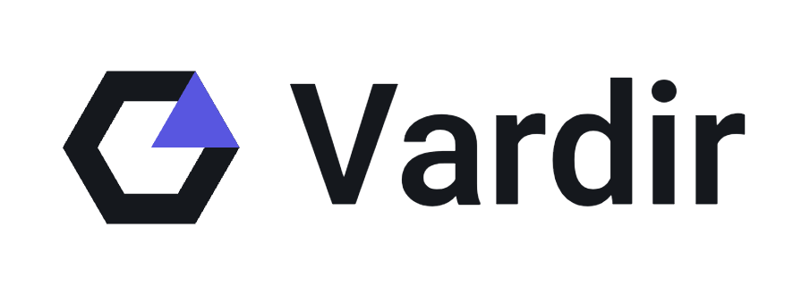
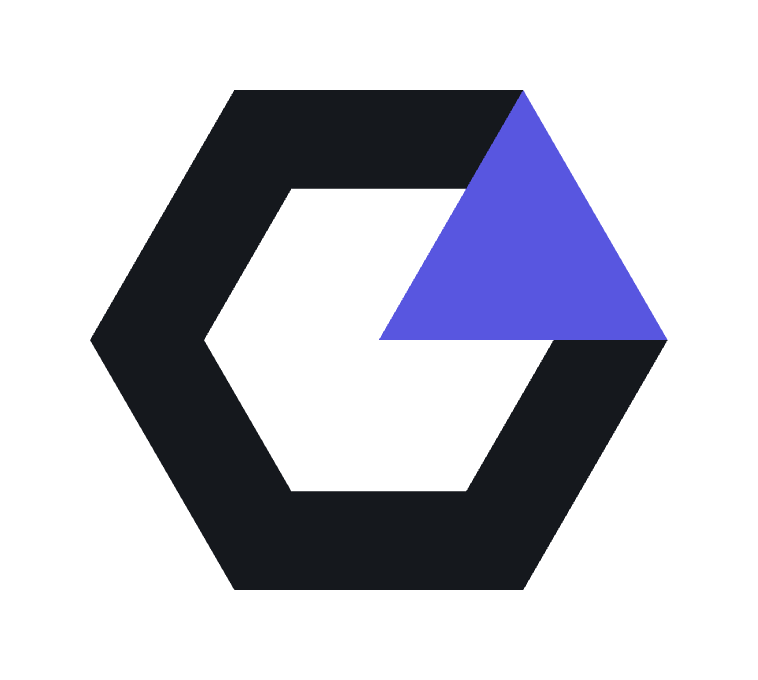

  

  <strong>Software built to last.</strong> 
  Independent software from Halden, Norway.

  <a href="https://github.com/vardirhq?tab=repositories">Projects</a> ·
  <a href="https://github.com/vardirhq/skald">Skald</a> ·
  <a href="https://github.com/vardirhq/vitni">Vitni</a> ·
  <a href="https://github.com/vardirhq/sindri-engine">Sindri</a>

---

Vardir is an independent software workshop building **local-first applications, developer tools, infrastructure, and experiments** with a bias toward ownership, longevity, and useful software.

We build the kind of tools we want to exist: software that respects the machine it runs on, keeps users in control of their data, and does not turn every useful feature into another service dependency.

### What we care about

**Own your data.** Local-first is the default whenever the problem allows it. Files should stay portable, formats understandable, and cloud services optional rather than structural.

**Use the right tool.** Rust when correctness and native performance matter. TypeScript and React when they make a great interface faster to build. Kotlin for Android. SQLite when a database should simply be a file. Technology serves the product, not the other way around.

**Make it understandable.** Interesting software does not require mysterious software. We prefer explicit systems, useful documentation, inspectable formats, and architecture that can still be understood six months later.

**Build for real use.** Most Vardir projects begin with an actual annoyance, missing tool, or workflow worth improving. Some become products. Some remain experiments. Both are useful outcomes.

## Selected work

<table>
<tr>
<td width="50%" valign="top">

### [Skald](https://github.com/vardirhq/skald)

A local-first Markdown knowledge base where the vault remains a folder of files you own. Semantic documents, threads, backlinks, graph navigation, extensions, GitHub context, Mermaid diagrams, local history, and encrypted multi-device sync.

`knowledge` `local-first` `desktop`

</td>
<td width="50%" valign="top">

### [Vitni](https://github.com/vardirhq/vitni)

A structured investigation workspace for turning entities, relationships, evidence, sources, assertions, chronology, and review decisions into defensible case knowledge.

`investigation` `OSINT` `local-first`

</td>
</tr>
<tr>
<td width="50%" valign="top">

### [Sindri](https://github.com/vardirhq/sindri-engine)

A 2D game engine and editor stack written around a Rust engine core, Lua gameplay scripting, `wgpu` rendering, physics, scene tooling, and optional local AI-assisted workflows.

`Rust` `game-engine` `tooling`

</td>
<td width="50%" valign="top">

### [Fattern](https://github.com/vardirhq/fattern)

Local-first business software for Norwegian freelancers and small businesses, covering invoices, expenses, customers, products, and practical accounting workflows without making the cloud the center of everything.

`business` `Norway` `local-first`

</td>
</tr>
<tr>
<td width="50%" valign="top">

### [GESH](https://github.com/vardirhq/generic-encrypted-sync-hub)

A generic encrypted synchronization relay. Clients encrypt their data before it leaves the device; the relay moves encrypted state without receiving the content key.

`sync` `encryption` `infrastructure`

</td>
<td width="50%" valign="top">

### [Hodd](https://github.com/vardirhq/hodd)

A collection companion built around ownership, discovery, missing items, metadata, and the history of a collection rather than reducing everything to another inventory spreadsheet.

`collections` `metadata` `app`

</td>
</tr>
</table>

### More from the workshop

[**Deploid**](https://github.com/vardirhq/deploid) turns web projects into installable Android applications · [**Edda**](https://github.com/vardirhq/edda) explores visual design tooling for terminal interfaces · [**Cleanroom**](https://github.com/vardirhq/cleanroom) tackles Android cleanup · [**Searchy**](https://github.com/vardirhq/searchy) explores desktop search · and the repositories contain plenty of smaller utilities and experiments that escaped the perfectly reasonable fate of remaining weekend ideas.

## The workshop

Vardir is intentionally not a framework company or a single-stack collection of demos. Across the projects you will find:

  <code>Rust</code> · <code>TypeScript</code> · <code>React</code> · <code>Tauri</code> · <code>Electron</code> · <code>Kotlin</code> · <code>SQLite</code> · <code>PostgreSQL</code> · <code>Node.js</code> · <code>wgpu</code>

Local AI appears where it can materially improve a workflow, with a preference for local providers and explicit boundaries around remote services. AI is a capability, not a reason to surrender the rest of the application to somebody else's server.

## Status & contributions

Vardir is a working software workshop, which means the repositories cover different stages of their lives. Some are actively used applications, some are being developed toward releases, some are research projects, and some are archived predecessors kept for reference. **The README in each repository is the source of truth for that project's current status.**

Issues, bug reports, discussions, and pull requests are welcome where enabled. Check the individual repository before contributing for project-specific guidance, supported platforms, and development setup.

---

    
  <strong>Vardir</strong> 
  Independent software · Halden, Norway · Maintained by <a href="https://github.com/MadsenDev">Christoffer Madsen</a>

